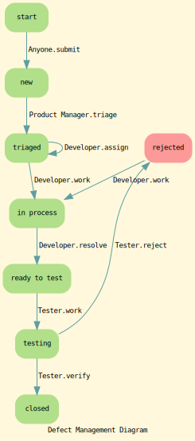

# Defect管理

## Defect的状态

- new
- triage
- in process
- ready to test
- testing
- rejected
- closed
- blocked

## Defect的修复原因

- fixed
- cannot reproduce
- duplicated
- function as designed
  it is not a bug.
- need not to fix
  it is a bug, but we need not to fix.

## Defect管理流程图

